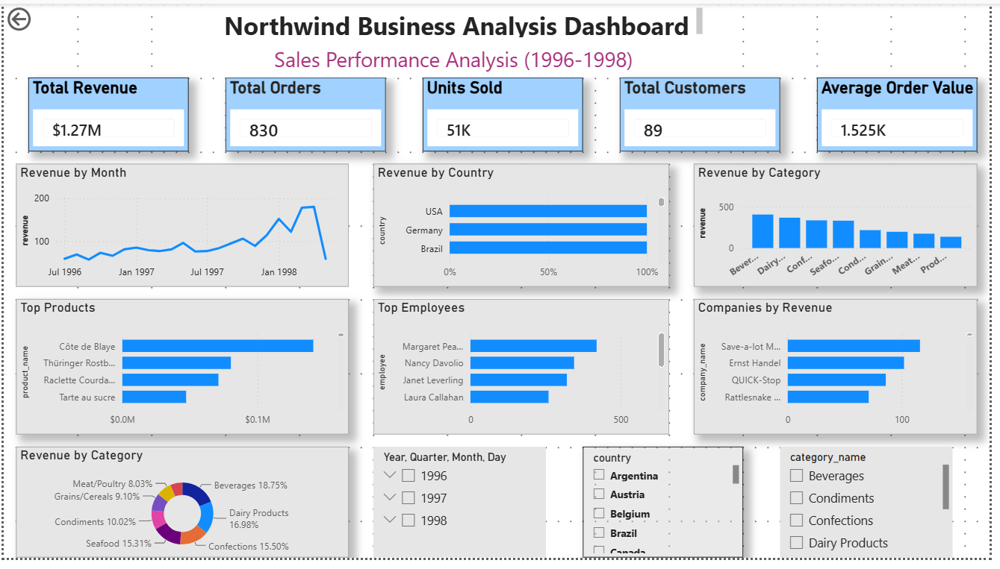
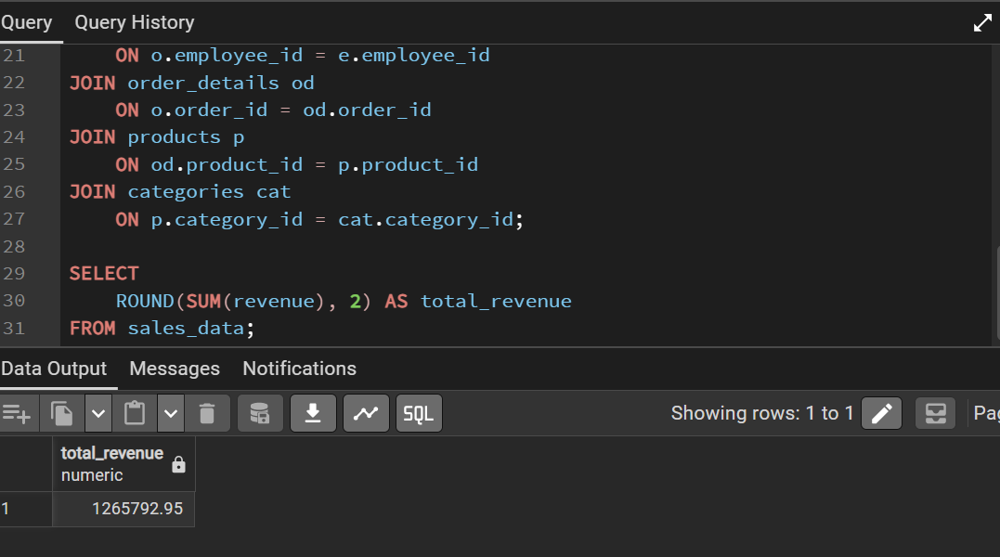
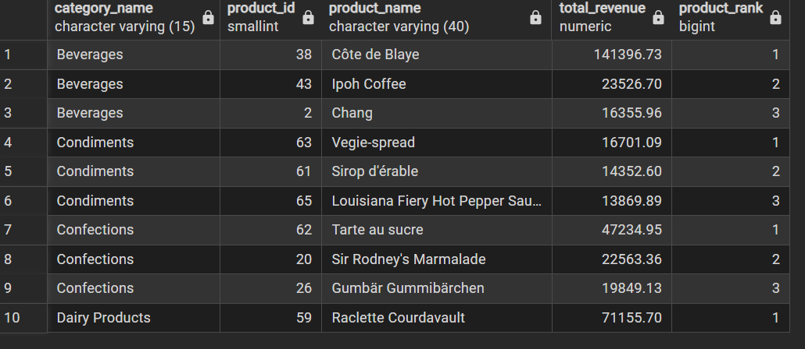
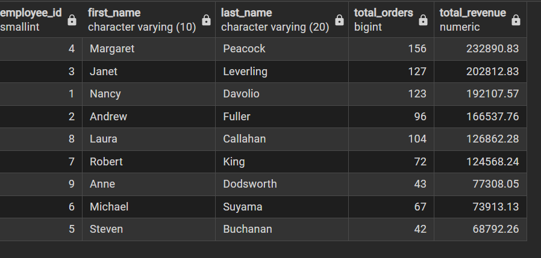

# 📊 Northwind Business Analysis Dashboard

## 📌 Project Overview

This project analyzes sales performance using the Northwind database. Data was extracted from PostgreSQL using SQL, transformed into a business-friendly sales view, and visualized in Power BI to provide actionable business insights.

The dashboard helps monitor revenue, orders, customers, product performance, employee performance, geographic sales, and category trends.

---

# 📷 Dashboard Preview




# 🛠 Tools Used

- PostgreSQL 18
- SQL
- pgAdmin 4
- Power BI Desktop
- Northwind Sample Database

---

# 📂 Dataset

Database: **Northwind**

The dashboard uses a custom SQL view named **sales_data**, created by joining multiple tables:

- Orders
- Order Details
- Customers
- Employees
- Products
- Categories

---

# SQL View

The SQL view combines sales transactions into a single reporting table containing:

- Order ID
- Order Date
- Customer
- Company
- Country
- Product
- Category
- Quantity
- Unit Price
- Discount
- Revenue
- Employee

## SQL Analysis

### Total Revenue Calculation



### Top Products



### Top Employees




# 📈 Dashboard KPIs

The dashboard includes the following business KPIs:

- 💰 Total Revenue
- 📦 Total Orders
- 👥 Total Customers
- 📦 Units Sold
- 💵 Average Order Value

---

# 📊 Dashboard Visualizations

### Revenue Analysis

- Revenue by Month
- Revenue by Country
- Revenue by Category

### Product Analysis

- Top Products
- Revenue by Category (Donut Chart)

### Employee Analysis

- Top Employees

### Customer Analysis

- Companies by Revenue

### Interactive Filters

- Year
- Country
- Product Category

---

# 📌 Key Business Insights

### Revenue

- Total revenue exceeded **$1.27M** during the reporting period.

### Customers

- Sales were generated from **89 unique customers**.

### Orders

- The company processed **830 orders**.

### Products

- Over **51,000 units** were sold.

### Geography

- Germany, USA, Brazil, and France generated the highest revenue.

### Product Categories

- Beverage and Dairy Products contributed the largest share of revenue.

### Employee Performance

- Sales performance varies among employees, helping identify top performers.

---


# 📁 Repository Structure

```
Northwind-Business-Analysis/
│
├── README.md
├── LICENSE
├── Northwind-Business-Analysis.pbix
├── 00_original_database.sql
├── 01_create_sales_data_view.sql
├── 02_analysis_queries.sql
│
└── screenshots/
    ├── dashboard.png
    ├── sql-total-revenue.png
    ├── sql-top-products.png
    └── sql-top-employees.png

---
### Skills Demonstrated

• SQL Joins
• PostgreSQL Views
• Data Cleaning
• Data Modeling
• DAX Measures
• KPI Design
• Interactive Dashboards
• Business Analysis
• Data Visualization
# Skills Demonstrated

### SQL

- INNER JOIN
- Views
- Calculated Columns
- Data Transformation

### PostgreSQL

- Database Design
- View Creation
- Query Optimization

### Power BI

- Data Import
- Data Modeling
- DAX Measures
- KPI Cards
- Line Charts
- Bar Charts
- Donut Charts
- Slicers
- Dashboard Design

---

# Business Value

This dashboard enables business users to:

- Monitor revenue performance
- Identify top-selling products
- Track employee sales performance
- Analyze sales by country
- Compare product category performance
- Explore sales interactively using filters

---

# Author

**Md Shariful Islam**

Data Analyst | SQL | PostgreSQL | Power BI


**GitHub:**  
[Sharifu-Analytics](https://github.com/Sharifu-Analytics)

**LinkedIn:**  
[Md Shariful Islam](https://linkedin.com/in/islam-freelancer)

**Email:**  
[islam.md@gmail.com](mailto:islam.md@gmail.com)